# KV Store — Refined Design (settled)

> The agreed design. Spec only — no alternatives, no debate. This is what gets built and presented.
> Reasoning behind each choice: [design-human.md](design-human.md) (decision table `D-H*`) · [notes.md](notes.md) (skim layer) · [reference-locking.md](reference-locking.md) (background).

**Status:** Part 1 ✅ settled · Part 2 ✅ settled · Part 3 ✅ settled (design only) — **design phase complete; next step is the implementation plan**

---

## Part 1 — Single node, in-memory ✅ SETTLED

### Stack
Go, standard library only (`net/http`, `encoding/json`, `sync`). No external dependencies. Single static binary — matters for Part 2, where we launch N copies.

### Data model

```go
const FirstVersion uint64 = 1        // named constant; version 0 never exists

type Store struct {
    parts []*partition               // count fixed at startup, power of 2, configurable
    mask  uint64                     // len(parts)-1
}

type partition struct {
    mu sync.RWMutex                  // guards this partition's map STRUCTURE only
    m  map[string]*Entry             // pointer: sync primitives must not be copied
}

type Entry struct {
    mu      sync.RWMutex             // guards this key's data + version
    data    json.RawMessage          // raw JSON bytes, stored verbatim
    version uint64                   // always >= FirstVersion
}

func (s *Store) part(key string) *partition {
    return s.parts[hashKey(key)&s.mask]     // power of 2 → bitmask, not modulo
}
```

**Hash map, not a tree.** No ordered iteration is required, and hashing makes the phantom-range problem structurally impossible.

**Three-level locking**, each layer earning its place — the `ConcurrentHashMap` shape:

| Layer | Guards | Held for |
|-------|--------|----------|
| Partition `RWMutex` | map structure of one stripe | pointer lookup, or a complete insert |
| `Entry.RWMutex` | one key's data + version | the read-modify-write, including the PATCH merge |

Rationale for splitting entry work out of the structure lock is lock *duration*, not granularity: PATCH's critical section is long (decode → merge → encode), so it must not run under a lock shared with unrelated keys.

Rationale for striping the structure lock is twofold. The exclusive `Lock()` is taken only on the create path, but with a single global map lock **every first-write to any key serialises globally** — and first-writes are a large share of KV traffic. Less obviously, `RWMutex.RLock()` is not free either: it atomically bumps a shared reader counter, and that cacheline bounces between every reading core even with no writers present. Striping splits it across N independent mutexes, so reads speed up too.

**Partition count:** power of 2, default 32–64, configurable at startup. Bitmask (`& mask`) rather than modulo. Fixed for the process lifetime — resizing would rehash everything and there is no reason to. Diminishing returns past roughly 4× core count; more partitions cost map overhead and cache locality. (Java's `ConcurrentHashMap` shipped with 16.)

**Hash function: FNV-1a** (`hash/fnv`) — deterministic and stdlib. Explicitly **not** `hash/maphash`, which seeds randomly per process: harmless for in-process striping, but fatal in Part 2, where two nodes must agree on where a key lives. Choosing a stable hash now lets the same function carry forward unchanged.

**`RWMutex` on the entry** so concurrent GETs on a hot key don't serialise against each other.

**Striping changes no semantics.** Every invariant below holds unmodified — the partition lock simply *is* the map lock, narrower. Pure optimisation, not a redesign.

**Forward link to Part 2:** `key → hash → partition → map` and `key → hash → slot → node` are the same mechanism with different destinations. The hash function is shared; the fan-out counts stay independent.

### Semantics

| Rule | Behaviour |
|------|-----------|
| First write | `version = 1` |
| Every successful write | `version++` |
| History | None retained — current version only |
| `ifVersion` supplied, matches | Proceed |
| `ifVersion` supplied, mismatches | `409` |
| `ifVersion` supplied, key absent | `409` (0 is not a valid version) |
| `ifVersion` omitted | Unconditional write (last-writer-wins) |

**PATCH rules:**
1. Key absent → create with `delta` as the value, `version = 1`.
2. Key present **and** both current value and `delta` are JSON objects → **shallow merge** top-level fields, `delta` wins on conflict, `version++`.
3. Otherwise (either side not an object) → replace wholesale, `version++`.

### API

| Method | Endpoint | Body | Success | Errors |
|--------|----------|------|---------|--------|
| `GET`   | `/kv/{key}` | — | `200 {key,value,version}` | `404` |
| `PUT`   | `/kv/{key}?ifVersion=N` | JSON value | `200 {key,value,version}` | `400` malformed JSON · `409` version mismatch |
| `PATCH` | `/kv/{key}?ifVersion=N` | JSON delta | `200 {key,value,version}` | `400` · `409` |

**409 body carries the current version:**
```json
{"error": "version mismatch", "key": "user:42", "version": 7}
```
Lets a client's retry loop skip the re-GET round trip. Mirrors DynamoDB's `ReturnValuesOnConditionCheckFailure`.

Bodies are validated as JSON on write, so GET can never return malformed content.

### Read path

```go
p := s.part(key)
p.mu.RLock(); e, ok := p.m[key]; p.mu.RUnlock()
if !ok { return 404 }

e.mu.RLock()
data, version := e.data, e.version    // snapshot, release immediately
e.mu.RUnlock()
return 200, data, version
```

The lock is held only to copy out a consistent `(data, version)` pair — nanoseconds. It is **not** optional: an unsynchronised read is a Go data race, and a reader could otherwise observe new data paired with an old version, pass a stale `ifVersion` guard, and lose an update silently.

### Write path

```go
p := s.part(key)

for {
    // --- exists path ---
    p.mu.RLock(); e, ok := p.m[key]; p.mu.RUnlock()
    if ok {
        e.mu.Lock()
        defer e.mu.Unlock()
        if ifVersionSet && ifVersion != e.version {
            return 409, e.version
        }
        e.data = compute(e.data, body)     // PUT replace | PATCH merge — INSIDE the lock
        e.version++
        return 200
    }

    // --- create path: finished entry, inserted under the partition write lock ---
    p.mu.Lock()
    if _, exists := p.m[key]; !exists {     // double-check
        if ifVersionSet { p.mu.Unlock(); return 409 }
        p.m[key] = &Entry{data: body, version: FirstVersion}
        p.mu.Unlock()
        return 200
    }
    p.mu.Unlock()
    // lost the create race — key exists now — loop back to the exists path
}
```

Three invariants this encodes:

1. **The guard lives inside the lock.** Read-version → check → compute → write is one critical section. Splitting it anywhere reintroduces lost updates, even though every individual access is still locked.
2. **The create path double-checks under the write lock.** Without it, two goroutines can hold *different* `*Entry` for the same key, both lock successfully, and one write vanishes.
3. **No partially-initialised entry ever enters the map.** The entry is complete at insert, so a failed write (409, 400) cannot strand a phantom. Cheap because the create path never merges — PUT-create stores the body verbatim, PATCH-create stores the delta verbatim.

`compute` allocates a new buffer; it never writes into the existing one in place.

### Diagrams

**Lock layers.** Two independent levels — the partition guards map structure, the entry guards one key's contents.

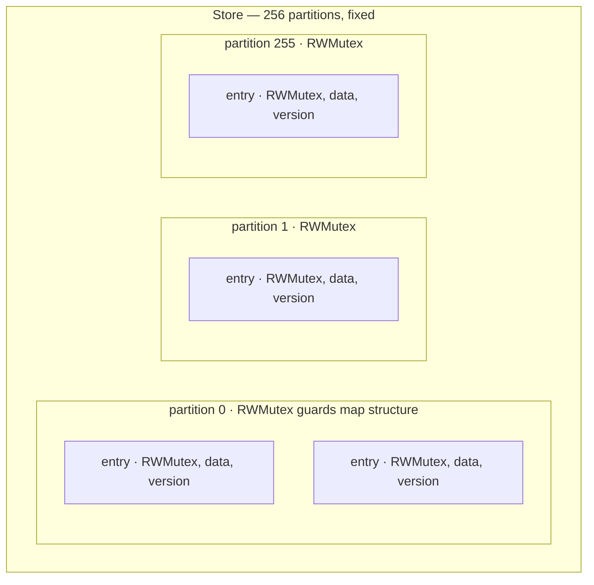
```mermaid
flowchart TB
    subgraph S["Store — 256 partitions, fixed"]
        direction LR
        subgraph P0["partition 0 · RWMutex guards map structure"]
            direction TB
            E0["entry · RWMutex, data, version"]
            E1["entry · RWMutex, data, version"]
        end
        subgraph P1["partition 1 · RWMutex"]
            direction TB
            E2["entry · RWMutex, data, version"]
        end
        subgraph PN["partition 255 · RWMutex"]
            direction TB
            E3["entry · RWMutex, data, version"]
        end
    end
```

**Read path — `GET /kv/:key`.** The entry lock is held only long enough to copy out a consistent pair.

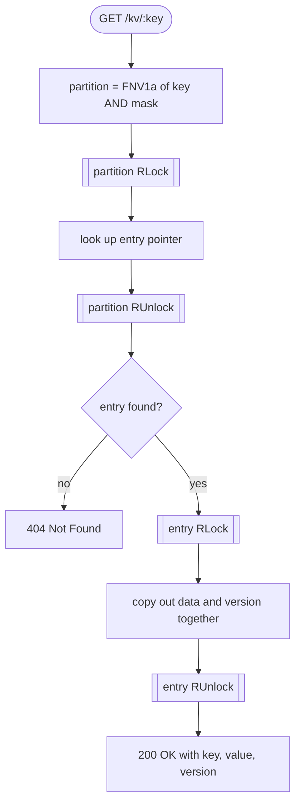
```mermaid
flowchart TD
    START(["GET /kv/:key"]) --> H["partition = FNV1a of key AND mask"]
    H --> RL[["partition RLock"]]
    RL --> LOOK["look up entry pointer"]
    LOOK --> RU[["partition RUnlock"]]
    RU --> EX{"entry found?"}
    EX -->|no| E404["404 Not Found"]
    EX -->|yes| EL[["entry RLock"]]
    EL --> SNAP["copy out data and version together"]
    SNAP --> EU[["entry RUnlock"]]
    EU --> OK["200 OK with key, value, version"]
```

**Write path — `PUT` and `PATCH`.** Identical control flow; they differ only inside *compute*. Note that the guard, the compute and the version bump all sit inside one entry lock, and that the create path inserts an already-complete entry.

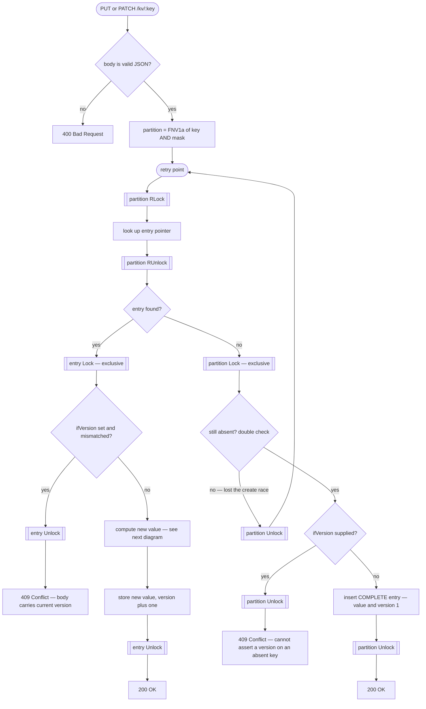
```mermaid
flowchart TD
    START(["PUT or PATCH /kv/:key"]) --> V{"body is valid JSON?"}
    V -->|no| E400["400 Bad Request"]
    V -->|yes| H["partition = FNV1a of key AND mask"]
    H --> RETRY(["retry point"])

    RETRY --> RL[["partition RLock"]]
    RL --> LOOK["look up entry pointer"]
    LOOK --> RU[["partition RUnlock"]]
    RU --> EX{"entry found?"}

    EX -->|yes| EL[["entry Lock — exclusive"]]
    EL --> GUARD{"ifVersion set and mismatched?"}
    GUARD -->|yes| EU1[["entry Unlock"]]
    EU1 --> C409["409 Conflict — body carries current version"]
    GUARD -->|no| COMP["compute new value — see next diagram"]
    COMP --> BUMP["store new value, version plus one"]
    BUMP --> EU2[["entry Unlock"]]
    EU2 --> OK200["200 OK"]

    EX -->|no| PL[["partition Lock — exclusive"]]
    PL --> DC{"still absent? double check"}
    DC -->|"no — lost the create race"| PU1[["partition Unlock"]]
    PU1 --> RETRY
    DC -->|yes| IFV{"ifVersion supplied?"}
    IFV -->|yes| PU2[["partition Unlock"]]
    PU2 --> C409B["409 Conflict — cannot assert a version on an absent key"]
    IFV -->|no| INS["insert COMPLETE entry — value and version 1"]
    INS --> PU3[["partition Unlock"]]
    PU3 --> OK200B["200 OK"]
```

**Compute — the PUT/PATCH difference.** Always allocates; never writes into the existing buffer.

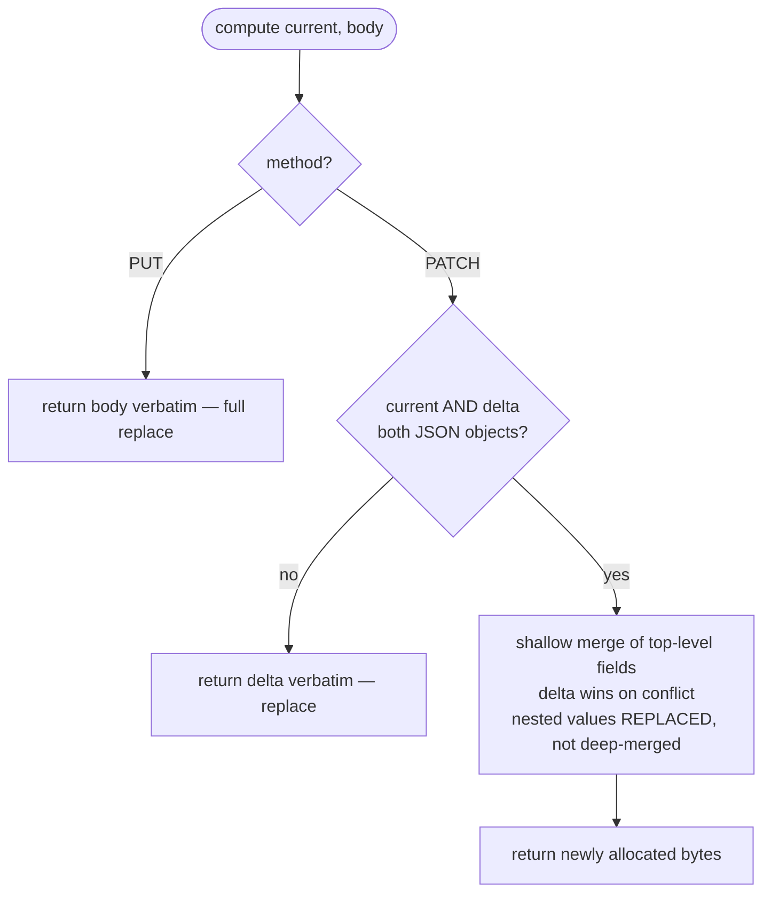
```mermaid
flowchart TD
    IN(["compute current, body"]) --> M{"method?"}
    M -->|PUT| REP["return body verbatim — full replace"]
    M -->|PATCH| OBJ{"current AND delta<br/>both JSON objects?"}
    OBJ -->|no| REP2["return delta verbatim — replace"]
    OBJ -->|yes| MERGE["shallow merge of top-level fields<br/>delta wins on conflict<br/>nested values REPLACED, not deep-merged"]
    MERGE --> OUT["return newly allocated bytes"]
```

### Testing

- **Unit:** version starts at 1 and increments · `ifVersion` match / mismatch / absent-key · PATCH merge vs replace vs create · malformed JSON → 400 · GET missing → 404.
- **Required — 300 counter:** 3 clients × 100 increments on one key → exactly 300. Run under `go test -race`; the race flag is the real proof, not the passing total.
- **Create race:** N goroutines PUT the same new key simultaneously → exactly N successful writes, final version == N, no lost write.

**The counter test needs a client-side CAS loop.** Server-side locking alone will not produce 300 — an increment is GET-then-PUT, two round trips, and nothing stops another client writing in between. The harness must loop: GET → compute → `PUT?ifVersion=v` → on 409, retry with the version from the error body. A harness that PUTs unconditionally scores below 300 and looks like a server bug when it is a protocol-usage bug.

### Deliberately not built (prepared answers)

| Item | Position |
|------|----------|
| `DELETE` | Not in spec. Would need `mapMu.Lock()` *and* a tombstone flag on the entry — the map lock alone doesn't stop a goroutine that already holds the `*Entry` pointer from writing into an orphan. |
| ~~Create-only write~~ | **Reversed during implementation — now built.** The 300-counter landed on 298, because a CAS loop cannot protect its *first* write: with the key absent there is no version to assert, so it must write unconditionally, and two clients doing that concurrently both succeed while one increment is lost. `ifVersion` cannot express "only if absent" (ruling R3), so the store gained `IfAbsent` — DynamoDB's `attribute_not_exists`, Cassandra's `IF NOT EXISTS`. Not optional: it is what closes the CAS loop. |
| COW / lock-free reads | `atomic.Pointer[Snapshot]` over an immutable `{data, version}` — readers never block. This is MVCC, and Go's GC reclaims dead snapshots for free (no `VACUUM`, no purge thread, no version bloat). Roadmap; ship `RWMutex` unless Parts 1–2 land early. |
| Narrowed lock + retry | Computing outside the lock and re-validating the version under a second lock is correct and shortens the hold, but wastes whole merges under contention. Present as the alternative; ship the simple form. |
| Consistent snapshot of all keys | Part 2's `GET /kv` walks partitions **one at a time** rather than locking them all. Keys never move between partitions, so any key present for the whole scan is guaranteed to appear; keys created mid-scan may or may not. Locking every partition at once would give a true snapshot at the cost of blocking all writes — not worth it for a list endpoint. |

---

## Part 2 — Multi-node ✅ SETTLED

### Vocabulary (fixed — used consistently everywhere)

| Term | Meaning |
|------|---------|
| **node** | one standalone store process |
| **partition** | the unit of placement **and** the in-process lock stripe — 256 of them, fixed for the life of the cluster |
| **proxy** | stateless router in front; holds the routing table, stores nothing |

A node **owns a set of partitions**. Kafka uses "partition" for exactly this; Redis calls the same thing a "slot".

### Topology — routing proxy (option #1)

```
                    ┌─────────┐
   curl ──────────► │  proxy  │  stateless, holds routing table only
                    └────┬────┘
              ┌──────────┼──────────┐
              ▼          ▼          ▼
          ┌───────┐  ┌───────┐  ┌───────┐
          │node-1 │  │node-2 │  │node-3 │   each runs Part 1 code UNCHANGED
          │ p0-85 │  │p86-170│  │p171-255│
          └───────┘  └───────┘  └───────┘
```

**Routing:** `key → FNV-1a → partition (256) → node`, via an explicit `map[partitionID]nodeID` table loaded from config.

**Partition count is fixed and independent of node count.** This is the whole design. `node = hash(key) % nodeCount` is the trap: a key stays put only when `h%3 == h%4`, so growing 3→4 nodes moves **~75% of all keys**. With a partition table, the same growth moves 64 of 256 partitions — **exactly 25%**, the theoretical minimum.

| Approach | Keys moved 3→4 nodes | Requires |
|---|---|---|
| `hash % nodeCount` | ~75% | nothing |
| Consistent hash ring (Dynamo, Cassandra) | ~25% | ring + virtual nodes |
| **Partition table (chosen)** | **25%, exactly** | a lookup table |

Consistent hashing achieves the same optimality without a central table and suits gossip/P2P clusters. The explicit table is chosen because placement can be *inspected and deliberately controlled* — the same reason Redis Cluster uses one.

**On balance:** modulo of a good hash distributes keys evenly — 1M keys over 3 nodes lands within ~0.2%. Balance was never the problem; resharding was. At the partition layer, 256/3 → 86/85/85 (~1% skew), 256/7 → 37×4 + 36×3 (~3%). Finer granularity improves balance, which is why Redis picked 16384 for ~1000-node clusters.

**Unresolvable by any hashing scheme: hot keys.** Uniform *key* distribution is not uniform *load*; one celebrity key saturates one node. Mitigations are caching, read replicas (Part 3), or application-level key splitting — not partitioning.

### Why Part 1 needs no changes

Each key lives on exactly **one** node. That node runs the Part 1 store verbatim, so per-key atomicity, the `ifVersion` guard, and version numbering are preserved without a single new line of concurrency code. **The proxy takes no locks and holds no state.** Sharding contributed zero concurrency complexity — precisely because we partitioned rather than replicated. That property is what makes Part 3 the interesting part.

### Component delta — what actually gets built

**Node — three changes from Part 1, nothing else:**

1. `--node-id` and `--listen` flags.
2. `GET /kv` → NDJSON of its own keys, stamped with its own node-id.
3. Owned-partition set → reject misrouted keys with **421 Misdirected Request** (~5 lines, see below).

**The node does not know the cluster exists.** No peer list, no routing table, no awareness of which partitions "should" be elsewhere. It keeps all 256 partitions internally; only the ~85 it is routed keys for ever fill up, and empty maps cost nothing. It stores whatever it is handed. That ignorance is the reason Part 1's code survives untouched, and is worth stating explicitly in the walkthrough.

**Why the 421 check earns its five lines:** without it, a proxy misconfiguration silently writes a key to the wrong node. The write returns `200`, and every subsequent read is routed elsewhere and returns `404` — data effectively lost, with no error raised anywhere in the system. With an owned-partition set the node rejects the request immediately. **421 Misdirected Request** is precisely the right status: it exists for a request directed at a server that cannot serve that authority. It is the concrete defence against the two-proxies-disagree failure, and it demos well — misconfigure the proxy deliberately and watch the node catch it. The fuller version adds a routing-table version header; the partition check alone catches most cases.

**Proxy and node expose the identical API.** The node's `GET /kv` lists its own keys; the proxy's `GET /kv` fans out and concatenates. Same endpoint, same format, so the proxy is a transparent pass-through and a lone node is simply a one-node cluster. A client can be pointed at either.

**Proxy — the only genuinely new component:**
- routing table loaded from config
- `GET | PUT | PATCH /kv/{key}` → hash → table lookup → forward → stream response back
- `GET /kv` → concurrent fan-out, stream-merge, error line on failure
- keep-alive / connection pooling to nodes
- no locks, no state

**The proxy forwards bytes; it must not re-encode.** Status codes and bodies pass through verbatim. Re-serialising responses would drop the `version` field from the 409 body, silently degrading every client's CAS retry loop into an extra round trip — or breaking it outright.

### `GET /kv` — list all keys, NDJSON

Format: one JSON object per line, `{"key": "some-key", "node": "node-id"}`.

**Why NDJSON rather than a JSON array:**
- **Merging is concatenation.** Interleaving line streams from N nodes needs no parsing. Combining N JSON arrays means stripping brackets and repairing commas — the proxy would have to parse and rewrite.
- **Constant memory** in both proxy and client, regardless of keyspace size. A JSON array must be buffered whole (or need a streaming parser handling partial arrays).
- **Mid-stream error signalling is possible** — just emit another line. After `[` has been sent in an array, there is no clean way to say "something failed".
- **Incremental consumption** — the client processes line 1 without waiting for line N.
- **Line tooling works**: `jq`, `grep`, `head`, `wc -l`. Demo-friendly.

**Node stamps its own ID.** The node knows what it is; making the proxy correlate lines back to connections is needless bookkeeping.

**Listing takes no entry locks.** Only key *names* are needed, and names live in the partition map, not the entry. Take the partition `RLock`, iterate names, release. A key being written concurrently still lists correctly, because its name is not what is changing. Availability over freshness — the exact right trade for a list endpoint.

**Partitions are walked one at a time**, not locked all at once. Keys never move between partitions, so any key present for the whole scan appears; keys created mid-scan may or may not. Locking every partition would give a true snapshot at the cost of blocking all writes.

**Proxy streams, never buffers.** Fans out concurrently, forwards lines as they arrive over HTTP chunked transfer. NDJSON has no ordering requirement, so interleaving is free.

**Partial failure:** if a node fails mid-stream, `200 OK` and hundreds of lines have already been sent and cannot be retracted. The proxy emits a final error line — `{"error":"node-3 unreachable"}` — and the operation is treated as failed. Clients must check for it. (Pagination was considered: streaming already solves the memory problem, and pagination only adds *resumability* at the cost of a cursor encoding per-node position with no global ordering. Not built.)

### Adding a node — config change, not live migration

Routing lives in an explicit config-driven table, so adding a node is a config change plus restart. **Online migration is deliberately not implemented** — Part 2 asks for capacity and throughput scaling, not online resharding, and it is a strong Part 3 candidate instead.

The design, for the roadmap discussion — **freeze-and-flip**:
1. Proxy marks partition P `migrating A→B`. **All traffic continues to A**, which stays the single source of truth, so per-key atomicity is never ambiguous.
2. Bulk-copy P's keys A→B in the background.
3. **Freeze P** at the proxy (queue requests, do not fail them) — milliseconds.
4. Copy the final delta, flip the table entry, unfreeze.

This freezes 1/256 of the keyspace at a time. The alternative is Redis Cluster's protocol: source marks the slot *migrating*, target *importing*, and a miss on the source returns **ASK** so the client retries at the target — with `MIGRATE` moving one key atomically (dump + restore + delete). That is why Redis needs both ASK (temporary, per-key) and MOVED (permanent, per-slot). Freeze-and-flip avoids the dual-ownership window entirely for a few ms of latency. Estimated ~200–250 lines: dump/restore endpoints on nodes, plus a proxy state machine.

### Alternative topology — peer-to-peer (option #2, designed not built)

Every node knows the full routing table; no proxy. A node receiving a request it does not own either forwards it or redirects. This is Redis Cluster's server side (MOVED) and Cassandra's coordinator model.

Rejected for this assignment because it buys little: only ~1/N of requests land on the owner by luck, and the rest cost either two hops (forward) or two client round trips (redirect) — the same or worse than the proxy. Redis makes it pay only because real clients **cache** the routing table; with `curl` it is strictly worse.

Worth noting if presenting it: HTTP **307** preserves method and body, so `curl -L -X PUT -d '...'` follows the redirect correctly. **302 would not** — it permits rewriting to GET.

Full pros-and-cons comparison of the two topologies is in [notes.md](notes.md). The short version of the real distinction: the choice is not "proxy or no proxy" but **how many copies of the routing table must agree**. With a proxy the table lives only in the routing tier and the data nodes know nothing about topology; peer-to-peer replicates it across the data tier and therefore requires gossip or external consensus; a smart client puts a copy in every client and survives only because clients tolerate staleness and recover via redirects. Copy count determines how much coordination machinery the design forces you to build.

**Build so both are reachable:** the routing table lives in its own package consumed by *both* proxy and node. Option #2 then becomes a thin delta (the node gains forward/redirect), and the claim "same routing core, two topologies" is honest without building both.

### Protocol

| Aspect | Value |
|---|---|
| Transport | HTTP/1.1, keep-alive, connection pool proxy→node |
| Single-key request/response body | `application/json` |
| `GET /kv` response | `application/x-ndjson`, `Transfer-Encoding: chunked` |
| `ifVersion` | query parameter, decimal `uint64` |
| Proxy→node paths | identical to client→proxy; forwarded verbatim |
| Status codes | `200` · `400` malformed body or `ifVersion` · `404` absent key · `409` version mismatch, body carries current version · `421` misrouted key · `502/503` node unreachable |

**The proxy forwards bytes.** It does not parse or re-encode responses — re-serialising would drop the `version` field from the `409` body and silently break every client's retry loop.

**The proxy never retries a write.** A timeout is ambiguous: the write may well have been applied, with only the response lost. Retrying a read-modify-write that already succeeded **double-applies it** — the counter goes 41 → 43 for a single logical increment. `ifVersion` protects against *concurrent writers*, not against *duplicate delivery of your own request*; making retries safe would need an idempotency key. Retries happen only on a definitively received `409`, never on a timeout or transport error.

### Sequence — routed single-key operation

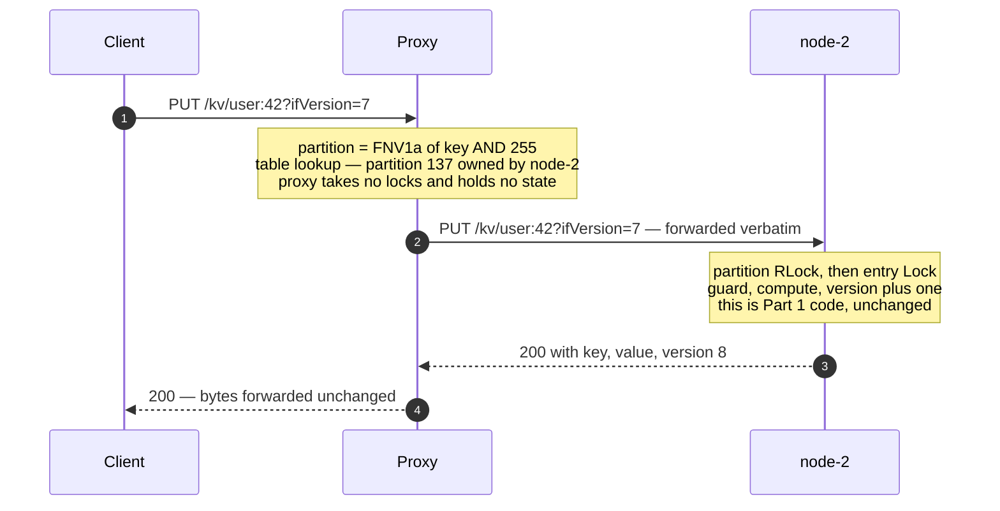
```mermaid
sequenceDiagram
    autonumber
    participant C as Client
    participant P as Proxy
    participant N2 as node-2

    C->>P: PUT /kv/user:42?ifVersion=7
    Note over P: partition = FNV1a of key AND 255<br/>table lookup — partition 137 owned by node-2<br/>proxy takes no locks and holds no state
    P->>N2: PUT /kv/user:42?ifVersion=7 — forwarded verbatim
    Note over N2: partition RLock, then entry Lock<br/>guard, compute, version plus one<br/>this is Part 1 code, unchanged
    N2-->>P: 200 with key, value, version 8
    P-->>C: 200 — bytes forwarded unchanged
```

### Sequence — CAS resolving a lost update

The 300-counter, drawn. Two clients read the same version; one wins, one is rejected and retries using the version handed back in the `409`.

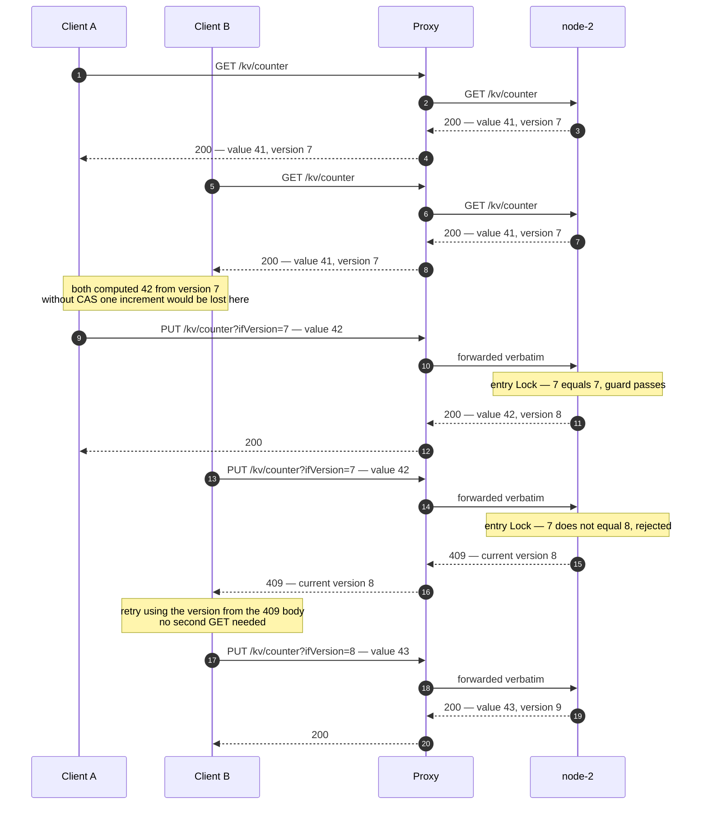
```mermaid
sequenceDiagram
    autonumber
    participant A as Client A
    participant B as Client B
    participant P as Proxy
    participant N as node-2

    A->>P: GET /kv/counter
    P->>N: GET /kv/counter
    N-->>P: 200 — value 41, version 7
    P-->>A: 200 — value 41, version 7

    B->>P: GET /kv/counter
    P->>N: GET /kv/counter
    N-->>P: 200 — value 41, version 7
    P-->>B: 200 — value 41, version 7

    Note over A,B: both computed 42 from version 7<br/>without CAS one increment would be lost here

    A->>P: PUT /kv/counter?ifVersion=7 — value 42
    P->>N: forwarded verbatim
    Note over N: entry Lock — 7 equals 7, guard passes
    N-->>P: 200 — value 42, version 8
    P-->>A: 200

    B->>P: PUT /kv/counter?ifVersion=7 — value 42
    P->>N: forwarded verbatim
    Note over N: entry Lock — 7 does not equal 8, rejected
    N-->>P: 409 — current version 8
    P-->>B: 409 — current version 8

    Note over B: retry using the version from the 409 body<br/>no second GET needed
    B->>P: PUT /kv/counter?ifVersion=8 — value 43
    P->>N: forwarded verbatim
    N-->>P: 200 — value 43, version 9
    P-->>B: 200
```

### Sequence — `GET /kv` fan-out with partial failure

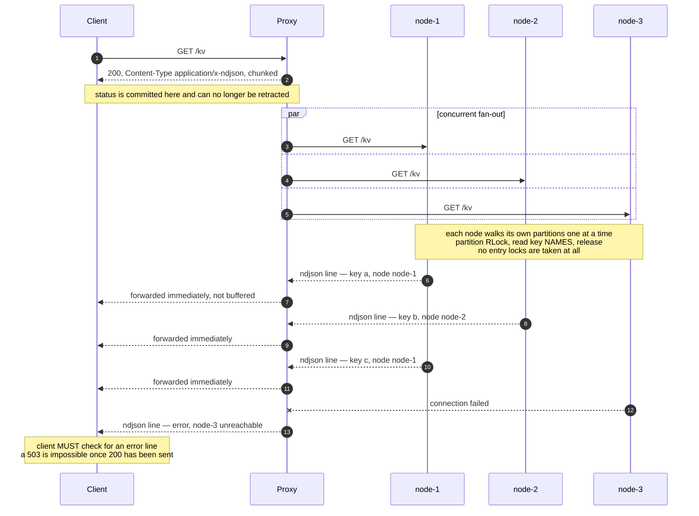
```mermaid
sequenceDiagram
    autonumber
    participant C as Client
    participant P as Proxy
    participant N1 as node-1
    participant N2 as node-2
    participant N3 as node-3

    C->>P: GET /kv
    P-->>C: 200, Content-Type application/x-ndjson, chunked
    Note over P,C: status is committed here and can no longer be retracted

    par concurrent fan-out
        P->>N1: GET /kv
    and
        P->>N2: GET /kv
    and
        P->>N3: GET /kv
    end

    Note over N1,N3: each node walks its own partitions one at a time<br/>partition RLock, read key NAMES, release<br/>no entry locks are taken at all

    N1-->>P: ndjson line — key a, node node-1
    P-->>C: forwarded immediately, not buffered
    N2-->>P: ndjson line — key b, node node-2
    P-->>C: forwarded immediately
    N1-->>P: ndjson line — key c, node node-1
    P-->>C: forwarded immediately
    N3--xP: connection failed
    P-->>C: ndjson line — error, node-3 unreachable
    Note over C: client MUST check for an error line<br/>a 503 is impossible once 200 has been sent
```

Exact line format:

```
{"key":"a","node":"node-1"}
{"key":"b","node":"node-2"}
{"error":"node-3 unreachable"}
```

### Sequence — misrouted key caught by the node

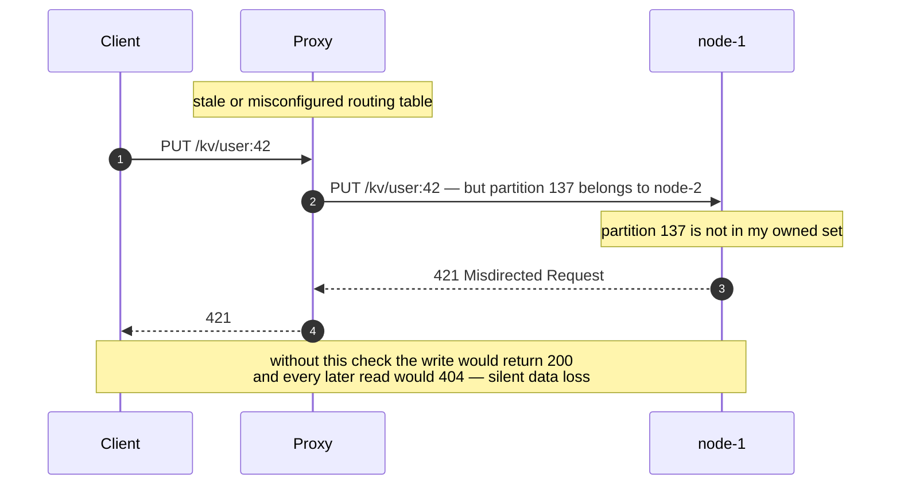
```mermaid
sequenceDiagram
    autonumber
    participant C as Client
    participant P as Proxy
    participant N1 as node-1

    Note over P: stale or misconfigured routing table
    C->>P: PUT /kv/user:42
    P->>N1: PUT /kv/user:42 — but partition 137 belongs to node-2
    Note over N1: partition 137 is not in my owned set
    N1-->>P: 421 Misdirected Request
    P-->>C: 421
    Note over C,N1: without this check the write would return 200<br/>and every later read would 404 — silent data loss
```

### Testing

- Launch 3 nodes + proxy from one script.
- Write M keys; assert `GET /kv` shows a roughly even spread across nodes and every key appears exactly once.
- **Re-run the 300-counter through the proxy** → still exactly 300. Proves routing preserves per-key atomicity.
- Kill a node → `GET /kv` emits the error line; requests for its partitions fail cleanly.
- Assert the same key always routes to the same node (hash determinism across processes — the reason FNV-1a was chosen over `maphash`).

---

## Part 3 — Replication & HA ✅ SETTLED (design only)

> Full option analysis, all diagrams, and the rejected alternatives: **[part3-options.md](part3-options.md)**. This section is the settled decision.

**Chosen: tunable consistency per operation, with spread replica placement.**

### The core idea

The Part 1 API already ships two write modes — with `ifVersion` and without — for reasons that had nothing to do with replication. Under replication they map exactly onto two consistency levels, so consistency is paid for **only on the operations that asked for it**:

| Write | Path | Consistency | Cost |
|---|---|---|---|
| `PUT` / `PATCH` unconditional | quorum write, W=2 | eventually consistent | 1 round trip, available during elections |
| `PUT` / `PATCH` with **`ifVersion`** | consensus (Raft) | linearizable | ~4 round trips, needs a majority |

The 300-counter still passes, because it uses `ifVersion` and therefore takes the consensus path. This is what Cassandra ships (normal writes plus LWT), arrived at independently.

**Mandatory constraint:** all writes for a given key must use the same path. Mixing them lets a quorum write clobber a consensus-decided value. The proxy enforces this per-key policy — a correctness requirement, not a convenience.

### Two stores per node — the paths must not share replication ownership

The per-key path policy is not merely routing: **it decides which of two logically separate stores the key lives in.**

| | Consensus store | Quorum store |
|---|---|---|
| Holds | keys assigned to the consensus path | keys assigned to the quorum path |
| Replicated by | Raft log + snapshots | direct writes, W=2 |
| Repaired by | heartbeats and log replay | anti-entropy |
| Included in snapshots | **yes** | **never** |
| Does leadership matter | yes | **no** |

**Why this separation is mandatory, not stylistic.** On the quorum path the W=2 acks may come from the two *followers*, leaving the Raft leader holding a stale copy — which is perfectly correct in itself, since leadership is meaningless for quorum-path keys and `R + W > N` guarantees a read still overlaps a current replica.

But `InstallSnapshot` says *"here is my complete state, replace yours."* If the Raft state machine contained quorum-managed keys, a leader with a stale quorum copy would ship it to a catching-up follower and **silently roll back a correct quorum write**. Keeping quorum keys out of the state machine removes that failure mode by construction.

Two consequences:

- **Anti-entropy is scoped to the quorum store only.** Running Merkle comparison across consensus keys could overwrite log-derived state with whatever a peer happened to hold.
- **Changing a key's path is a migration between stores**, not a config flag — rare, deliberate, and requiring the key to be quiesced. A real limitation, and better stated than discovered.

The two stores share the same partition map and the same Part 1 locking; only *replication ownership* must not be shared.

**This also explains, rather than merely asserts, why the quorum path stays available during a leader election: it never needed a leader.**

### Replication

- **RF = 3**, replicas **spread** across nodes rather than paired. Odd RF because RF=4 tolerates the same single failure as RF=3 at 33% more storage; RF=2 tolerates none.
- **Hard constraints:** no two replicas of one partition on the same node (otherwise RF is fiction); a partition's replicas must span failure domains (rack/AZ).
- **Soft constraints:** balance replica count (capacity) and leader count (leaders absorb all consensus writes, so skew is a write hotspot). Leadership skews on its own because Raft elections are randomised — correcting it needs explicit `TransferLeadership`.
- Spread over paired: when a node dies, its load spreads across all survivors (≈+20% each at 6 nodes) instead of one standby inheriting +100%.
- **Decouple the counts here.** 256 partitions is right for lock striping but far too many Raft groups (256 sets of heartbeats). Use ~16 replication groups. Parts 1–2 deliberately unified the number; Part 3 is where it splits.

### Quorum path

`N=3, W=2, R=2`, **strict** quorum. Strict preserves `R + W > N`, so a successful write is always readable; sloppy quorum would be more available but can return `200` for a write no read can find.

Conflict resolution is a **`(version, writerNode)`** tiebreak — deterministic and clock-free. Wall-clock LWW depends on synchronised clocks and silently picks the wrong winner under skew, which is one of the most common ways Cassandra users lose data. `writerNode` is internal metadata; the API still exposes `version` as a plain integer.

### Repair — anti-entropy only

**Quorum masks staleness**, so correctness never depends on fast repair: with `W=2, R=2, N=3`, every read overlaps at least one current replica and the highest version wins.

- **Anti-entropy (chosen, sufficient alone):** per-partition Merkle tree, leaves hashed over `(key, version, writerNode)`. Replicas exchange root hashes — a match proves identity in **one round trip with no data transferred**. On mismatch, descend only into differing subtrees and ship only the differing keys. A write **marks its leaf dirty**; only dirty paths are recomputed before a run, so cost scales with *changes since the last run*, not dataset size.
- **Hinted handoff (deferred):** buys redundancy *margin*, not correctness — without it a stale replica leaves those keys effectively at RF=2 until the next run. Add if the repair interval proves too long.
- **Read repair (rejected):** puts repair work on the read path for every replica, and never covers cold data. Cassandra removed `read_repair_chance` in 4.0.

Affordable because **there is no DELETE**: no tombstones, so no `gc_grace_seconds` deadline, so a slow repair cycle costs redundancy margin and nothing else.

### In-memory storage, and what durability means here

A crashed node returns **empty**, and Raft requires durable `currentTerm`, `votedFor` and log — a node that forgets `votedFor` can vote twice in a term and elect two leaders.

**Resolution: a restarted node never rejoins as itself.** Remove the dead member, add a fresh one under a new ID, bootstrap via `InstallSnapshot`. A new member has never voted in any term, so the hazard cannot arise, and **no disk is required**. Cost: a membership change needs a majority of the old configuration, so simultaneous majority loss wedges the group until an operator intervenes.

> **Durability comes from replication factor, not from disk.** RF=3 across independent failure domains *is* the durability story. Lose a majority at once and the data is gone.

This is why spread placement matters beyond load balancing — failure-domain independence carries the entire durability argument.

### Adding a node — the same operation as recovery

Because a restarted node rejoins as a new member, **node recovery and node addition are one code path**:

```
1. Empty node joins
2. Placement driver selects partitions to move to it
3. Add to the Raft group as a LEARNER (non-voting)
4. Catch up via InstallSnapshot plus log replay
5. Promote to voter, remove an old member
6. Optionally TransferLeadership to rebalance
```

Step 3 is the one that is easy to get wrong: without learners, a 3-member group becomes a 4-member group with majority 3, and the still-empty node counts toward that quorum while catching up — **availability degrades during the transfer**. Learners replicate without voting, which is why Raft has them.

### The proxy becomes load-bearing

In Part 2 it only routes. Here it gains: leader-aware routing (with a lazy, redirect-driven cache — rebuildable, so it stays stateless), path selection, quorum orchestration, failover transparency, and enforcement of the per-key path policy. *"The proxy looked marginal in Part 2; it's load-bearing in Part 3."*

Hints, if ever added, go **node-side** — they are durable data, and a proxy holding them would no longer be stateless.

### Diagrams

Ten diagrams, in four groups: **how it works** (1–4), **node failure** (5–7), **new joiner** (8), **repair** (9), **the arc** (10).

---

#### 1. Topology — spread placement, worked at two cluster sizes

Six partitions, `RF = 3`. **★ = leader for that partition.** (Six is for legibility; the real design uses ~16 replication groups.)

##### 1a. Three nodes — RF equals node count

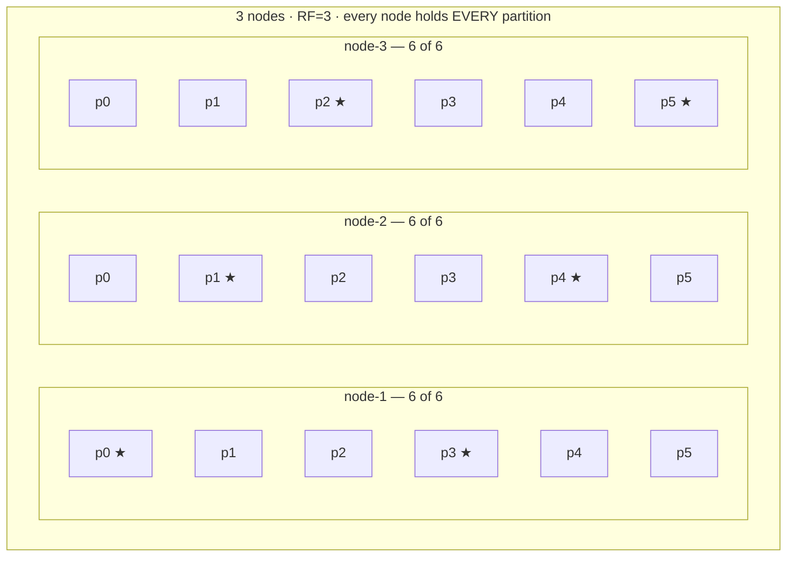
```mermaid
flowchart TB
    subgraph T3["3 nodes · RF=3 · every node holds EVERY partition"]
        direction LR
        subgraph A["node-1 — 6 of 6"]
            direction TB
            A0["p0 ★"]
            A1["p1"]
            A2["p2"]
            A3["p3 ★"]
            A4["p4"]
            A5["p5"]
        end
        subgraph B["node-2 — 6 of 6"]
            direction TB
            B0["p0"]
            B1["p1 ★"]
            B2["p2"]
            B3["p3"]
            B4["p4 ★"]
            B5["p5"]
        end
        subgraph C["node-3 — 6 of 6"]
            direction TB
            C0["p0"]
            C1["p1"]
            C2["p2 ★"]
            C3["p3"]
            C4["p4"]
            C5["p5 ★"]
        end
    end
```

| partition | node-1 | node-2 | node-3 |
|---|---|---|---|
| p0 | **★ L** | F | F |
| p1 | F | **★ L** | F |
| p2 | F | F | **★ L** |
| p3 | **★ L** | F | F |
| p4 | F | **★ L** | F |
| p5 | F | F | **★ L** |
| **replicas held** | 6 | 6 | 6 |
| **leaderships** | 2 | 2 | 2 |

**There is exactly one possible placement here, and it is worth saying out loud: every node holds 100% of the data.** With `RF = 3` on three nodes you gain redundancy and *zero* capacity. Leadership is the only thing that can be distributed.

##### 1b. Five nodes — capacity actually spreads

Partition *i* placed on nodes `(i, i+1, i+2) mod 5`, leader first.

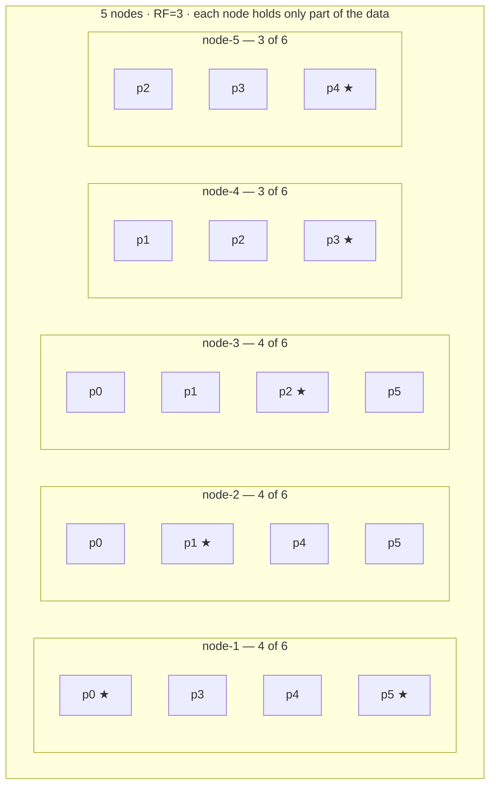
```mermaid
flowchart TB
    subgraph T5["5 nodes · RF=3 · each node holds only part of the data"]
        direction LR
        subgraph N1["node-1 — 4 of 6"]
            direction TB
            X0["p0 ★"]
            X3["p3"]
            X4["p4"]
            X5["p5 ★"]
        end
        subgraph N2["node-2 — 4 of 6"]
            direction TB
            Y0["p0"]
            Y1["p1 ★"]
            Y4["p4"]
            Y5["p5"]
        end
        subgraph N3["node-3 — 4 of 6"]
            direction TB
            Z0["p0"]
            Z1["p1"]
            Z2["p2 ★"]
            Z5["p5"]
        end
        subgraph N4["node-4 — 3 of 6"]
            direction TB
            W1["p1"]
            W2["p2"]
            W3["p3 ★"]
        end
        subgraph N5["node-5 — 3 of 6"]
            direction TB
            V2["p2"]
            V3["p3"]
            V4["p4 ★"]
        end
    end
```

| partition | node-1 | node-2 | node-3 | node-4 | node-5 |
|---|---|---|---|---|---|
| p0 | **★ L** | F | F | – | – |
| p1 | – | **★ L** | F | F | – |
| p2 | – | – | **★ L** | F | F |
| p3 | F | – | – | **★ L** | F |
| p4 | F | F | – | – | **★ L** |
| p5 | **★ L** | F | F | – | – |
| **replicas held** | 4 | 4 | 4 | 3 | 3 |
| **leaderships** | 2 | 1 | 1 | 1 | 1 |

Every partition still has three replicas on three **distinct** nodes — the hard constraint holds — but no node holds everything any more.

##### The rule this demonstrates

**Each node holds `RF / N` of the data.**

| Nodes | Data per node | Capacity gain vs one node |
|---|---|---|
| 3 | 3/3 = **100%** | **none** |
| 5 | 3/5 = 60% | 1.7× |
| 6 | 3/6 = 50% | 2× |
| 10 | 3/10 = 30% | 3.3× |
| 20 | 3/20 = 15% | 6.7× |

**Capacity only scales once `N > RF`**, and replication is a direct tax on it: `RF = 3` means three times the hardware for the same dataset. This is a genuine tension between the parts and worth naming — **Part 2 buys capacity, Part 3 spends it.** Adding replication to a three-node cluster buys availability and nothing else.

Note also that leadership is **imperfectly balanced** at five nodes (node-1 leads two, everyone else one) because six partitions do not divide evenly by five. That is exactly why the real design uses more replication groups than nodes: at 16 groups over 5 nodes it is 3.2 each, and the skew becomes negligible. Same argument as partition count in Part 2, one level up.

##### Growing 3 → 5 nodes

Compare the two tables: node-1 drops p1 and p2, node-2 drops p2 and p3, node-3 drops p3 and p4, and the two new nodes receive three partitions each. Six replica-copies move out of eighteen — **33%**, against a theoretical target of 40% (the share of capacity the new nodes should end up holding). Near-optimal, and crucially **whole partitions move; no key is ever rehashed.**

#### 2. Write routing — the request selects its own consistency level

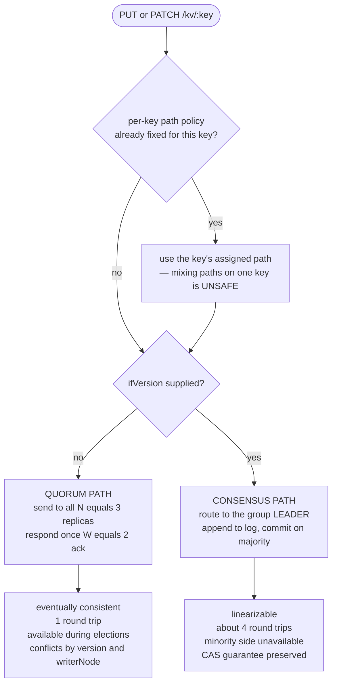
```mermaid
flowchart TD
    IN(["PUT or PATCH /kv/:key"]) --> POL{"per-key path policy<br/>already fixed for this key?"}
    POL -->|yes| USE["use the key's assigned path<br/>— mixing paths on one key is UNSAFE"]
    POL -->|no| Q{"ifVersion supplied?"}
    USE --> Q
    Q -->|no| QP["QUORUM PATH<br/>send to all N equals 3 replicas<br/>respond once W equals 2 ack"]
    Q -->|yes| CP["CONSENSUS PATH<br/>route to the group LEADER<br/>append to log, commit on majority"]
    QP --> QR["eventually consistent<br/>1 round trip<br/>available during elections<br/>conflicts by version and writerNode"]
    CP --> CR["linearizable<br/>about 4 round trips<br/>minority side unavailable<br/>CAS guarantee preserved"]
```

#### 3. Unconditional write — quorum path

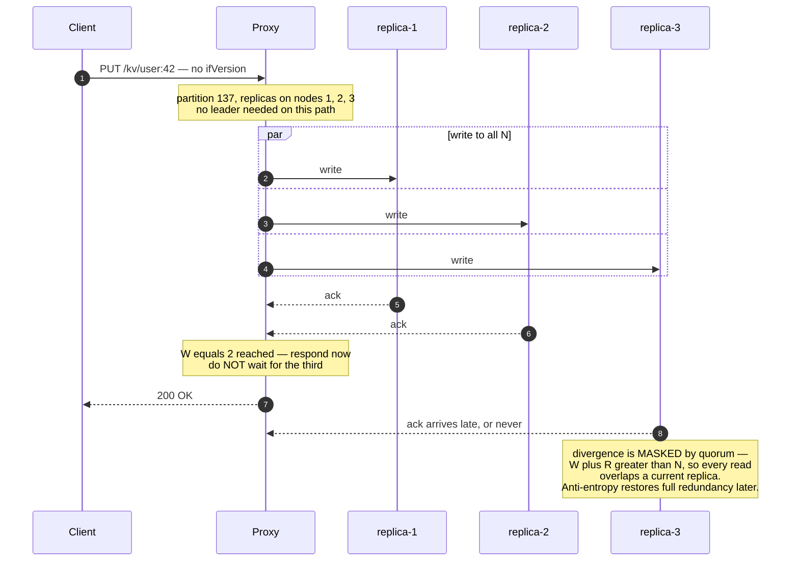
```mermaid
sequenceDiagram
    autonumber
    participant C as Client
    participant P as Proxy
    participant R1 as replica-1
    participant R2 as replica-2
    participant R3 as replica-3

    C->>P: PUT /kv/user:42 — no ifVersion
    Note over P: partition 137, replicas on nodes 1, 2, 3<br/>no leader needed on this path

    par write to all N
        P->>R1: write
    and
        P->>R2: write
    and
        P->>R3: write
    end

    R1-->>P: ack
    R2-->>P: ack
    Note over P: W equals 2 reached — respond now<br/>do NOT wait for the third
    P-->>C: 200 OK
    R3-->>P: ack arrives late, or never
    Note over R3: divergence is MASKED by quorum —<br/>W plus R greater than N, so every read<br/>overlaps a current replica.<br/>Anti-entropy restores full redundancy later.
```

#### 4. Conditional write — consensus path

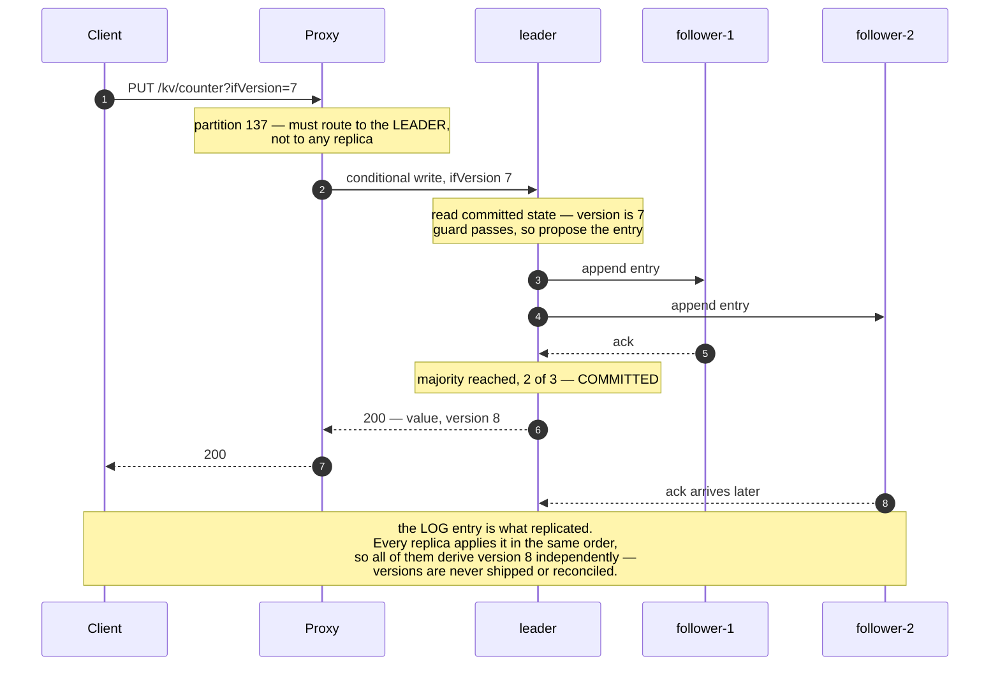
```mermaid
sequenceDiagram
    autonumber
    participant C as Client
    participant P as Proxy
    participant L as leader
    participant F1 as follower-1
    participant F2 as follower-2

    C->>P: PUT /kv/counter?ifVersion=7
    Note over P: partition 137 — must route to the LEADER,<br/>not to any replica
    P->>L: conditional write, ifVersion 7
    Note over L: read committed state — version is 7<br/>guard passes, so propose the entry
    L->>F1: append entry
    L->>F2: append entry
    F1-->>L: ack
    Note over L: majority reached, 2 of 3 — COMMITTED
    L-->>P: 200 — value, version 8
    P-->>C: 200
    F2-->>L: ack arrives later
    Note over C,F2: the LOG entry is what replicated.<br/>Every replica applies it in the same order,<br/>so all of them derive version 8 independently —<br/>versions are never shipped or reconciled.
```

##### Log index and per-key version are different counters

Worth stating precisely, because the shorthand "the version becomes the log index" is **not literally true**:

| | Scope | Advances on |
|---|---|---|
| **Raft log index** | **one per replication group** | any write to *any* key in that group |
| **Per-key version** | one per key | writes to that key only |

For a group holding keys A, B, C:

```
write A  → log index 1,  A.version = 1
write B  → log index 2,  B.version = 1
write A  → log index 3,  A.version = 2
```

**The accurate relationship — and the stronger claim — is that the log *determines* the versions.** Every replica applies the same entries in the same order, so identical per-key versions arise deterministically on all of them. Versions are never replicated or reconciled as data; they are a *result* of replaying the log. That is ordinary deterministic state-machine replication.

The practical consequence: there is no per-entry index to store. The log is an array, so the index is simply a position — one counter per group, sixteen in total. Per-key versions remain the 8 bytes per key already budgeted in Part 1.

---

#### 5. Node failure — two distinct modes, handled differently

**This design has no persistence, so the two ways a leader can "fail" are not the same event**, and conflating them is the classic mistake when adapting textbook Raft:

| Failure | State afterwards | Recovery path |
|---|---|---|
| **Process dies** | everything lost — no log, no term, no `votedFor` | rejoins as a **new member** with a new ID (diagram 8). It has never voted and never led, so **it can never return as a stale leader.** |
| **Network partition, process alive** | state **intact** — it still believes it leads term 4 | keeps accepting requests it can never commit; on heal, discovers the higher term and steps down |

**Consequence worth stating: a stale leader can only arise from a network partition, never from a crash.** Choosing option (b) — no disk, rejoin as a new member — removes the crash-restart case from the safety argument entirely.

##### 5a. Leader dies mid-write (process death)

The client-visible view, and the most important diagram in Part 3.

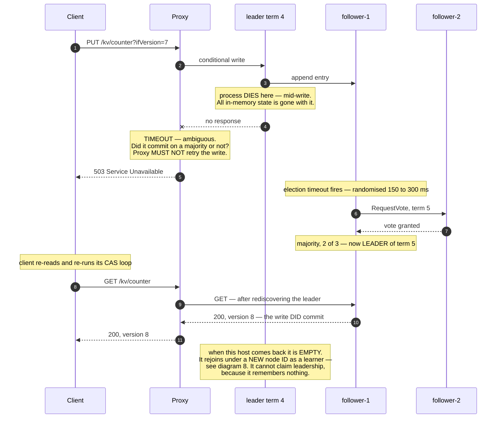
```mermaid
sequenceDiagram
    autonumber
    participant C as Client
    participant P as Proxy
    participant L as leader term 4
    participant F1 as follower-1
    participant F2 as follower-2

    C->>P: PUT /kv/counter?ifVersion=7
    P->>L: conditional write
    L->>F1: append entry
    Note over L: process DIES here — mid-write.<br/>All in-memory state is gone with it.
    L--xP: no response

    Note over P: TIMEOUT — ambiguous.<br/>Did it commit on a majority or not?<br/>Proxy MUST NOT retry the write.
    P-->>C: 503 Service Unavailable

    Note over F1: election timeout fires — randomised 150 to 300 ms
    F1->>F2: RequestVote, term 5
    F2-->>F1: vote granted
    Note over F1: majority, 2 of 3 — now LEADER of term 5

    Note over C: client re-reads and re-runs its CAS loop
    C->>P: GET /kv/counter
    P->>F1: GET — after rediscovering the leader
    F1-->>P: 200, version 8 — the write DID commit
    P-->>C: 200, version 8

    Note over L: when this host comes back it is EMPTY.<br/>It rejoins under a NEW node ID as a learner —<br/>see diagram 8. It cannot claim leadership,<br/>because it remembers nothing.
```

##### 5b. Leader partitioned but alive — the only way a stale leader exists here

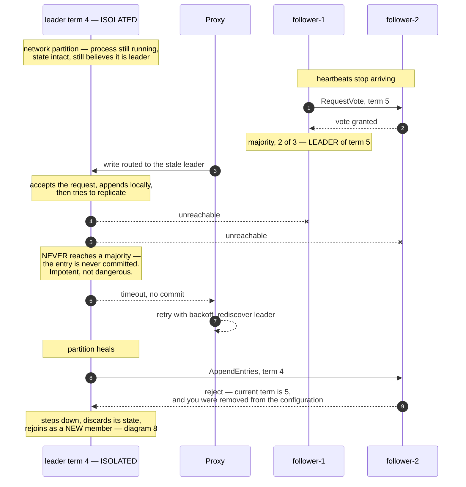
```mermaid
sequenceDiagram
    autonumber
    participant L as leader term 4 — ISOLATED
    participant P as Proxy
    participant F1 as follower-1
    participant F2 as follower-2

    Note over L: network partition — process still running,<br/>state intact, still believes it is leader
    Note over F1,F2: heartbeats stop arriving
    F1->>F2: RequestVote, term 5
    F2-->>F1: vote granted
    Note over F1: majority, 2 of 3 — LEADER of term 5

    P->>L: write routed to the stale leader
    Note over L: accepts the request, appends locally,<br/>then tries to replicate
    L--xF1: unreachable
    L--xF2: unreachable
    Note over L: NEVER reaches a majority —<br/>the entry is never committed.<br/>Impotent, not dangerous.
    L-->>P: timeout, no commit
    P-->>P: retry with backoff, rediscover leader

    Note over L: partition heals
    L->>F2: AppendEntries, term 4
    F2-->>L: reject — current term is 5,<br/>and you were removed from the configuration
    Note over L: steps down, discards its state,<br/>rejoins as a NEW member — diagram 8
```

**A stale leader is useless, not dangerous** — it can accept requests forever but can never commit one without a majority. That is why Raft is split-brain-safe. And because the placement driver removes a presumed-dead member from the configuration, a returning partitioned node is rejected on **two** grounds: stale term *and* no longer a member.

#### 6. Node failure — proxy rediscovers the leader

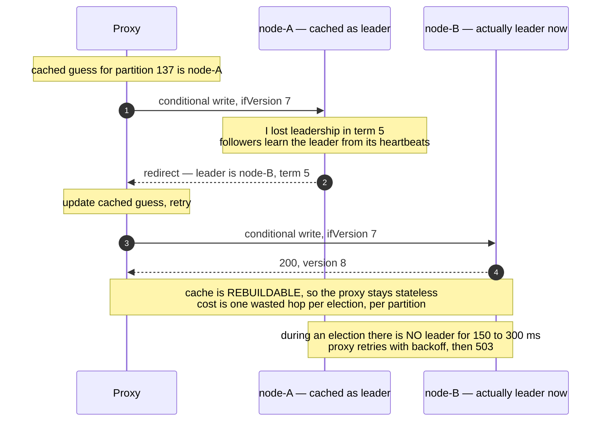
```mermaid
sequenceDiagram
    autonumber
    participant P as Proxy
    participant A as node-A — cached as leader
    participant B as node-B — actually leader now

    Note over P: cached guess for partition 137 is node-A
    P->>A: conditional write, ifVersion 7
    Note over A: I lost leadership in term 5<br/>followers learn the leader from its heartbeats
    A-->>P: redirect — leader is node-B, term 5
    Note over P: update cached guess, retry
    P->>B: conditional write, ifVersion 7
    B-->>P: 200, version 8

    Note over P,B: cache is REBUILDABLE, so the proxy stays stateless<br/>cost is one wasted hop per election, per partition
    Note over A,B: during an election there is NO leader for 150 to 300 ms<br/>proxy retries with backoff, then 503
```

**Retrying a redirect is safe; retrying a timeout is not.** A redirect definitively means "I did not apply your write." A timeout is ambiguous.

#### 7. Node failure — a lagging follower catches up

**Applies only to a follower whose process stayed alive** — partitioned, slow, or overloaded — so its log is still intact. A follower that *crashed* has no log at all and takes the new-member path in diagram 8 instead. No repair mechanism is involved here; this *is* the protocol.

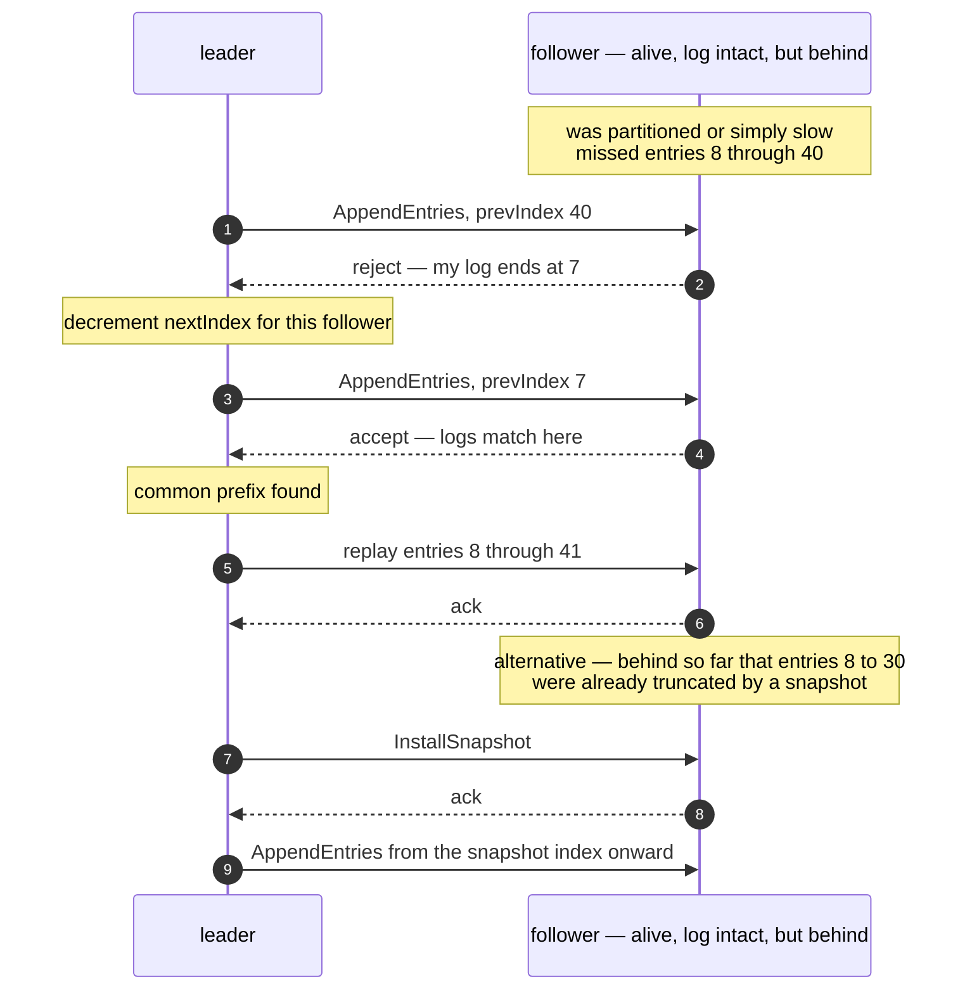
```mermaid
sequenceDiagram
    autonumber
    participant L as leader
    participant F as follower — alive, log intact, but behind

    Note over F: was partitioned or simply slow<br/>missed entries 8 through 40
    L->>F: AppendEntries, prevIndex 40
    F-->>L: reject — my log ends at 7
    Note over L: decrement nextIndex for this follower
    L->>F: AppendEntries, prevIndex 7
    F-->>L: accept — logs match here
    Note over L: common prefix found
    L->>F: replay entries 8 through 41
    F-->>L: ack

    Note over F: alternative — behind so far that entries 8 to 30<br/>were already truncated by a snapshot
    L->>F: InstallSnapshot
    F-->>L: ack
    L->>F: AppendEntries from the snapshot index onward
```

The `nextIndex` walk-back only works because the follower still **has** a log to match against. With no persistence, that is exactly what distinguishes a partitioned follower from a crashed one.

##### Why not simply send the follower the leader's current state?

You can — that is `InstallSnapshot`, and it is correct. Two reasons the walk-back exists anyway.

**Bandwidth.** Replaying 30 missed entries versus shipping 1 000 000 keys is roughly a 30 000× difference in the common case. Replay is the default; snapshot is the fallback once a follower is too far behind for replay to be worthwhile.

**Correctness — the one that actually matters.** A lagging follower may not merely be *missing* entries; it may hold **wrong** ones. Entries are replicated *before* they are committed, so a follower's log tail is speculative:

```
1. Leader L (term 4) appends entry X at index 41
2. X reaches follower F1 only — 2 of 5, NOT a majority, so X is never committed
3. L crashes
4. F2 campaigns in term 5. F3 and F4 vote for it (logs equal, ending at 40).
   With its own vote that is 3 of 5 — F2 WINS, despite F1 refusing.
5. F2 appends a DIFFERENT entry Y at index 41 and commits it
6. F1 reconnects holding X at 41. The truth is Y at 41.
   → F1 must DELETE X, not append after it.
```

Blindly accepting whatever arrives next would leave F1 with X at 41 and Y at 42 — **permanently divergent, and silently so.**

So `prevLogIndex` / `prevLogTerm` serve two purposes: locating how far behind a follower is, *and* locating where its log **diverged** so the bad tail can be truncated. The useful mental model: **a Raft log has a committed prefix (truth) and a speculative tail (maybe truth)**, and the walk-back finds the boundary between the follower's speculation and the cluster's reality.

**Note this is not ours to implement.** Both replay and snapshot come with `etcd/raft` or `hashicorp/raft`. The question is whether we understand what we are depending on, not whether we designed it.

##### Leader Completeness — why a rollback is always safe

The rollback case above is safe *because* entry X was never committed, and Raft only guarantees that **committed** entries survive. The reverse case is the one that shows why the election restriction exists.

Suppose the leader *had* reached a majority before dying — L, F1 and F3 hold entry 41, committed. F2 now campaigns: it needs 3 votes and gets its own plus F4's, but **F1 and F3 refuse**, because their logs are more up-to-date. F2 **cannot** win. Only F1 or F3 can, and either preserves entry 41.

That is the **Leader Completeness Property**: a committed entry lives on a majority, and any election winner needs a majority, so **the two sets must intersect**. The new leader is therefore guaranteed to already hold every committed entry — nothing has to be recovered from elsewhere, and no entry can be silently lost.

##### An isolated node cannot win — but it can be disruptive

If a follower is partitioned away from the rest, two independent mechanisms stop it becoming leader:

1. **Majority.** Its `RequestVote` messages reach nobody, so it collects one vote out of five and remains a candidate indefinitely.
2. **Election restriction.** Even once reconnected, if it is missing committed entries, voters refuse it — its log is not up to date.

**The real hazard is different.** While isolated it times out repeatedly and **increments its term on every attempt** — 5, 6, 7 … 47. On reconnect it sends `RequestVote` with term 47, the healthy leader observes a higher term and **steps down**. A perfectly good leader is deposed by a node that was never eligible to lead, costing an unnecessary election and a brief unavailability window. This is the **disruptive server** problem.

**Fix: PreVote** (Raft §9.6). Before incrementing its term, a candidate runs a pre-election — *"would you vote for me if I asked?"* — without touching its term. An isolated node's pre-votes reach nobody, so its term never inflates and it disrupts nothing on return. `etcd/raft` implements this.

**Pair it with CheckQuorum:** a leader unable to reach a majority within one election timeout steps down voluntarily, which also prevents a partitioned leader from serving stale reads indefinitely.

##### How each path converges — they are not the same mechanism

| | Consensus path | Quorum path |
|---|---|---|
| Reconciliation | **every heartbeat**, ~50 ms | **scheduled anti-entropy** |
| Driven by | the leader, continuously | a timer |
| Divergence window | milliseconds | until the next repair run |
| Guarantee | linearizable | eventually consistent |

**On the consensus path, heartbeats *are* the consistency check.** The leader sends `AppendEntries` every ~50 ms, and each one carries `prevLogIndex`, `prevLogTerm` and `leaderCommit`. There is no separate catch-up process: a lagging follower rejects a heartbeat, the leader walks back, and replay begins. **Liveness detection and log reconciliation are the same message** — which is why this path needs no repair machinery at all. It is not really "eventually consistent"; it is *eventually caught up*, over a committed prefix that is linearizable throughout.

**On the quorum path there is no leader and no heartbeat**, so nothing reconciles continuously. A replica that missed a write stays divergent until anti-entropy runs. That is where eventual consistency actually lives in this design.

Because the path is fixed **per key** by policy, any given key is reconciled by exactly one of these mechanisms — never both.

##### Worked example — what the log holds, and what it produces

Each entry carries an **index**, a **term**, and a command:

```
idx  term  command
 1    4    SET a = 1
 2    4    SET b = 2
 3    4    SET a = 5
 4    4    SET a = 6
 5    5    SET c = 8      ← term 5: an election occurred here
```

Applying all five yields this state machine:

| key | value | version |
|---|---|---|
| a | 6 | **3** — written at indices 1, 3, 4 |
| b | 2 | 1 |
| c | 8 | 1 |

Note `a` sits at version 3 while its most recent log index is 4 — the same point as above, in miniature.

**The log is never reset on a new term.** Term is a *field on each entry*, not a partition of the log; the log is one continuous array spanning every term:

```
idx   1  2  3  4  5  6  7
term  4  4  4  4  5  5  6
                ↑     ↑
          election  election
```

If the log reset at each election, every leadership change would destroy all committed data. What actually happens:

| | On a new term |
|---|---|
| `log[]` | **unchanged** — every entry retained |
| `currentTerm` | increments |
| newly appended entries | tagged with the new term |
| a follower's **uncommitted divergent tail** | truncated — *only* the divergent portion |
| `nextIndex[]`, `matchIndex[]` | **reset** — the leader's tracking state, rediscovered by walk-back |

The last row is the likely source of the "logs reset" intuition: leader *tracking* state is discarded every election, but the log itself is not.

**Why terms exist:** `(index, term)` identifies an entry uniquely across the whole cluster — the Log Matching Property. If two logs share an entry with the same index and term, everything before it is identical. Without terms there would be no way to distinguish "entry 41 from the old leader" from "entry 41 from the new one," which is precisely the divergence case described above.

##### Log truncation — bound by bytes, not entries

The log is bounded: snapshots truncate the applied prefix, and a follower that falls behind the truncation point requires `InstallSnapshot`. `etcd/raft` triggers on `SnapshotCount` (default 10 000 entries), retaining a few entries past the snapshot so slightly-lagging followers can still replay rather than needing a full transfer.

**For an in-memory store, trigger on log *size*, not entry count.** With a 1 MB value limit (ruling R6), 10 000 entries could mean **10 GB of log held in RAM** alongside the state machine it duplicates. Snapshot on a byte threshold — 64 MB is a reasonable default. This is a decision forced specifically by being in-memory, and worth calling out as such.

##### What a replica actually holds, and whether snapshots cause downtime

Each replica keeps **two** structures, which the "log" discussion can obscure:

| | Contents | Size |
|---|---|---|
| **Log** | ordered *commands* — "set key K to value V" | bounded: recent tail only, truncated by snapshots |
| **State machine** | the actual KV data — key → `{value, version}` | the full dataset |

A catching-up follower receives **log entries**, appends them, and applies committed ones to its state machine. Real data moves, not merely a pointer — the index is a position *in* the log, and the log is what carries the values.

**Snapshot transfer causes no client-visible downtime.** The group retains a majority without the catching-up follower (leader plus one healthy follower), so writes keep committing at full rate throughout.

**The genuine risk is snapshot *creation* on the leader.** A naive implementation stops the world to serialise the state machine, and *that* is write downtime. Four mitigations:

1. **Copy-on-write snapshot** — take a consistent point-in-time view cheaply, then serialise it in the background while writes continue.
2. **`fork()`** — Redis's BGSAVE approach; the OS provides copy-on-write page tables and the child serialises a frozen view.
3. **Snapshot from a follower** — it is not serving writes, so it can block freely; transfer follower→follower and leave the leader untouched.
4. **Rate-limit the transfer**, or a large snapshot starves normal replication of bandwidth.

Option 1 is the **third payoff of the Part 1 COW design** (rung 3): lock-free reads, cheap Merkle tree construction for anti-entropy, and now non-blocking snapshots. One mechanism, three benefits — a strong argument for it in the roadmap.

##### Where follower progress is tracked — and why it needs no storage

`nextIndex[i]` (next log index to send to follower *i*) and `matchIndex[i]` (highest index known replicated there) are **two plain integers per follower, held by the leader alone**. Raft classifies them as *volatile state on leaders, reinitialised after election* — **no implementation persists them, with or without a disk.** They were never part of the persistence problem.

**The leader guesses and is then corrected.** On winning an election it sets `nextIndex[i] = lastLogIndex + 1` (optimistic) and `matchIndex[i] = 0` (pessimistic) for every follower. It has no idea where they actually are. The rejections are how it finds out — the walk-back is not consulting stored knowledge, it is **discovering state the leader never had**. Size is negligible: `2 × uint64 × (RF−1)` per group, about 512 bytes across 16 groups at RF=3.

| Raft state | Class | In our design |
|---|---|---|
| `nextIndex[]`, `matchIndex[]` | volatile, leader-only | memory; reset at every election — never needed disk |
| `commitIndex`, `lastApplied` | volatile | memory, rebuilt |
| `currentTerm`, `votedFor`, `log[]` | **persistent** | the only genuine problem — resolved by rejoining as a new member |

The persistence question therefore reduces entirely to those last three; everything else is derived or rediscovered.

*(Optimisation that comes free with the libraries: a naive walk-back decrements `nextIndex` by one per round trip, which is slow for a very stale follower. Raft §5.3 lets the follower attach a **hint** to its rejection — "my log ends at 7, term 3 began at index 5" — so the leader jumps straight there. `etcd/raft` implements this.)*

---

#### 8. New joiner — identical to recovery

##### Where the placement driver lives

**A dedicated "meta" Raft group, colocated on the same nodes.** We already run Raft for data partitions, so the placement driver is simply one more group whose state machine *is* the cluster state: membership, the partition→replica-set mapping, and leadership assignments. **Its leader is the placement driver.** Failover comes free from the same election machinery. Kafka's KRaft controller quorum and CockroachDB's system ranges are the same construction.

| Alternative | Verdict |
|---|---|
| A separate PD cluster (TiKV's PD is literally an etcd cluster) | Correct, but disproportionate — a 3-node store would need 3 more machines |
| Elect a balancer among the proxies | **Rejected** — it destroys the proxy's defining property. Proxies are stateless; durable placement authority would end that |
| Manual, operator-driven | The honest **phase 1**, consistent with Part 2's config-change stance. Automate afterwards |

**No circular dependency.** The meta group's own membership comes from static bootstrap configuration, not from the placement driver — it does not place itself, and its membership changes are rare and deliberate.

**Control plane, not data plane — the property that matters.** If the meta group loses quorum:

- data partitions **keep serving**; their Raft groups are independent and never consult the driver on the request path
- proxies **keep routing** from their cached table
- what stops is membership change, rebalancing, node addition, and replacing a dead node

So losing the placement driver **degrades management, not service** — the same principle that keeps the proxy stateless: authority lives in exactly one place, and everyone else holds a rebuildable cache.

**This also closes the open item from Part 2.** Two proxies disagreeing about the routing table during a change could misroute; the fix was a versioned table. **The meta group's Raft log index *is* that version** — monotonic, consistent, and free. Nodes reject requests carrying a stale table version, exactly as Redis Cluster uses its config epoch.

*(This one genuinely is a 1:1 correspondence, unlike the data path: the meta group's state machine is a single object — the routing table — so one log entry is exactly one table version. Per-key versions in the data path do **not** equal log indices, for the reason given above.)*

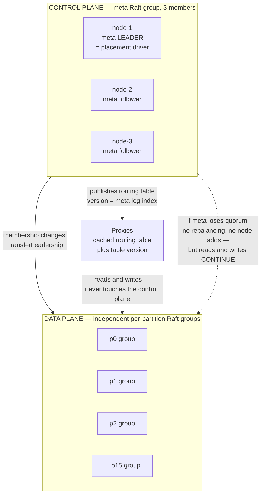
```mermaid
flowchart TB
    subgraph CP["CONTROL PLANE — meta Raft group, 3 members"]
        direction LR
        M1["node-1<br/>meta LEADER<br/>= placement driver"]
        M2["node-2<br/>meta follower"]
        M3["node-3<br/>meta follower"]
    end

    subgraph DP["DATA PLANE — independent per-partition Raft groups"]
        direction LR
        D1["p0 group"]
        D2["p1 group"]
        D3["p2 group"]
        D4["... p15 group"]
    end

    PX["Proxies<br/>cached routing table<br/>plus table version"]

    CP -->|"publishes routing table<br/>version = meta log index"| PX
    CP -->|"membership changes,<br/>TransferLeadership"| DP
    PX -->|"reads and writes —<br/>never touches the control plane"| DP

    CP -.->|"if meta loses quorum:<br/>no rebalancing, no node adds —<br/>but reads and writes CONTINUE"| DP
```

##### The joiner sequence

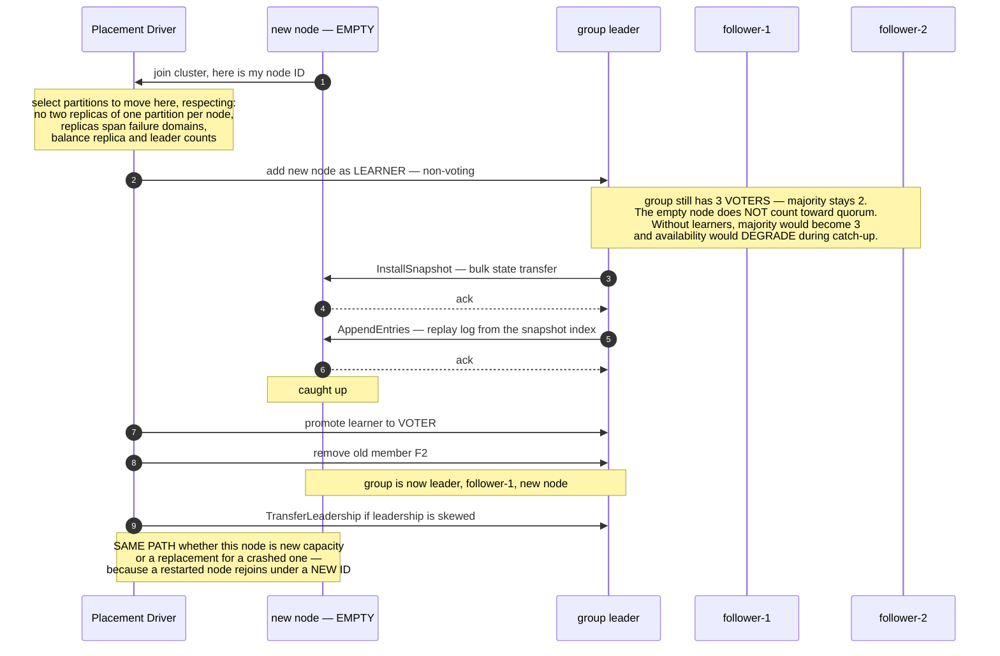
```mermaid
sequenceDiagram
    autonumber
    participant PD as Placement Driver
    participant N as new node — EMPTY
    participant L as group leader
    participant F1 as follower-1
    participant F2 as follower-2

    N->>PD: join cluster, here is my node ID
    Note over PD: select partitions to move here, respecting:<br/>no two replicas of one partition per node,<br/>replicas span failure domains,<br/>balance replica and leader counts

    PD->>L: add new node as LEARNER — non-voting
    Note over L,F2: group still has 3 VOTERS — majority stays 2.<br/>The empty node does NOT count toward quorum.<br/>Without learners, majority would become 3<br/>and availability would DEGRADE during catch-up.

    L->>N: InstallSnapshot — bulk state transfer
    N-->>L: ack
    L->>N: AppendEntries — replay log from the snapshot index
    N-->>L: ack
    Note over N: caught up

    PD->>L: promote learner to VOTER
    PD->>L: remove old member F2
    Note over L,N: group is now leader, follower-1, new node
    PD->>L: TransferLeadership if leadership is skewed

    Note over PD,N: SAME PATH whether this node is new capacity<br/>or a replacement for a crashed one —<br/>because a restarted node rejoins under a NEW ID
```

---

#### 9. Repair — anti-entropy via Merkle comparison

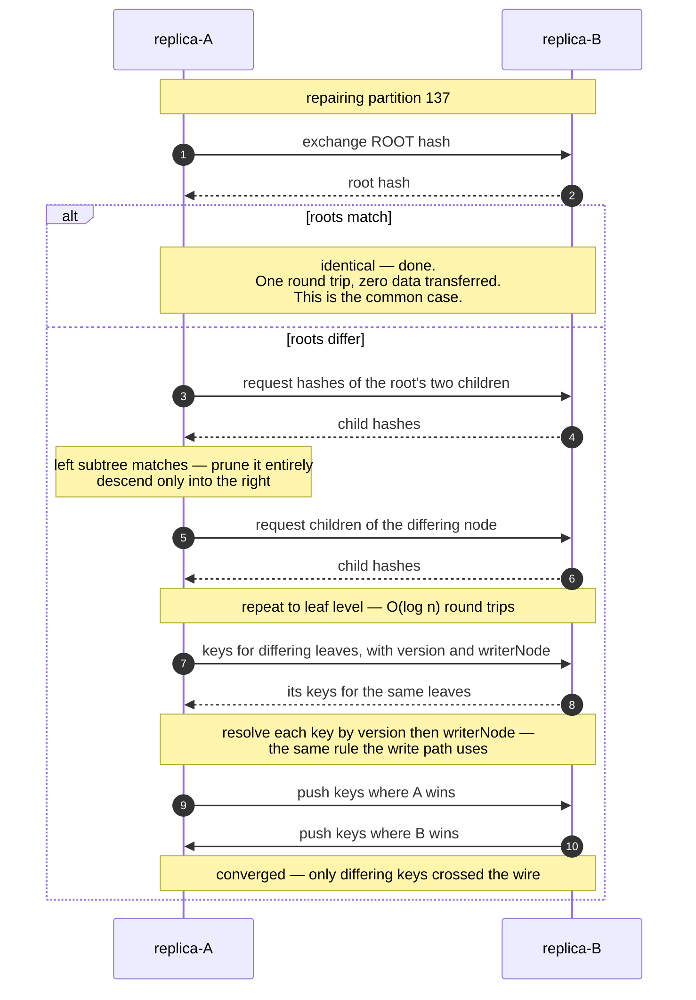
```mermaid
sequenceDiagram
    autonumber
    participant A as replica-A
    participant B as replica-B

    Note over A,B: repairing partition 137
    A->>B: exchange ROOT hash
    B-->>A: root hash

    alt roots match
        Note over A,B: identical — done.<br/>One round trip, zero data transferred.<br/>This is the common case.
    else roots differ
        A->>B: request hashes of the root's two children
        B-->>A: child hashes
        Note over A: left subtree matches — prune it entirely<br/>descend only into the right
        A->>B: request children of the differing node
        B-->>A: child hashes
        Note over A,B: repeat to leaf level — O(log n) round trips
        A->>B: keys for differing leaves, with version and writerNode
        B-->>A: its keys for the same leaves
        Note over A,B: resolve each key by version then writerNode —<br/>the same rule the write path uses
        A->>B: push keys where A wins
        B->>A: push keys where B wins
        Note over A,B: converged — only differing keys crossed the wire
    end
```

A write **marks its leaf dirty**; only dirty leaves and their root paths are recomputed before a run, so cost scales with changes since the last run, not with dataset size.

---

#### 10. The arc across all three parts

```mermaid
flowchart LR
    subgraph P1["Part 1 — single node"]
        direction TB
        A["version =<br/>per-key logical clock"] --> B["ifVersion = CAS<br/>ONE mutex is the<br/>serialization point"]
    end
    subgraph P2["Part 2 — partitioned"]
        direction TB
        C["key → hash →<br/>partition → node"] --> D["each key on exactly ONE node<br/>atomicity stays LOCAL<br/>zero new concurrency code"]
    end
    subgraph P3["Part 3 — replicated"]
        direction TB
        E["each partition →<br/>replica set"] --> F["the serialization point<br/>DISAPPEARS<br/>CAS now needs consensus<br/>and the API already said which ops need it"]
    end
    B --> C
    D --> E
```

### Known gaps, stated rather than hidden

- **Idempotency keys are missing.** A leader dying mid-write leaves an ambiguous timeout: the proxy correctly refuses to retry and returns `503`, but the client's own CAS retry can still double-apply (write commits, response lost, client re-reads 42 and writes 43). `ifVersion` prevents concurrent writers clobbering each other; it cannot detect *your own* duplicate delivery. The fix is a client request ID recorded by the leader.
- **A placement driver is a new component**, and it needs consensus itself — two balancers issuing conflicting moves would be a disaster. TiKV's PD is literally an etcd cluster.
- **Simultaneous majority loss is unrecoverable** and needs operator intervention. That is the honest cost of durability-by-replication.

### Effort and sequence

1. Embed `etcd/raft` or `hashicorp/raft` per replication group; snapshot and restore.
2. Leader-aware routing plus the redirect cache in the proxy.
3. Quorum write/read path and the `(version, writerNode)` tiebreak.
4. Per-key path policy enforcement.
5. Merkle trees with dirty marking; scheduled anti-entropy.
6. Placement driver: learner-based membership changes and leadership balancing.

Multi-week — which is exactly why this part is design-only.

### The closing line

**Part 2 was easy precisely because it partitioned instead of replicating.** Everything that makes Part 3 hard is the thing Part 2 deliberately avoided — which is why HA was correctly scoped out of the assignment: it is a different problem in kind, not in degree. (Diagram 10 above.)
